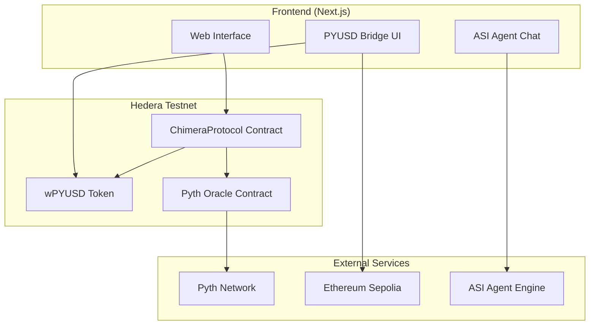
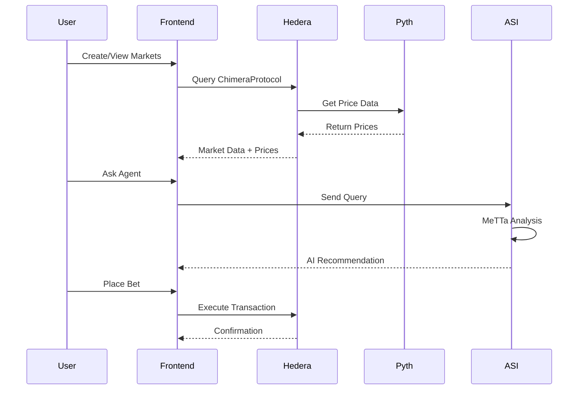

# ChimeraProtocol 🔮

AI-powered prediction markets on Hedera with Pyth Oracle integration and PYUSD betting.

## 🏗️ Architecture Overview



## 🎯 Core Technologies

### 🔗 Hedera Hashgraph
- Hedera Testnet EVM compatibility
- Direct contract calls via Hashio RPC
- HBAR gas fees
- 3-5 second finality

### 💰 PYUSD Stablecoin  
- PayPal USD integration
- Cross-chain bridge (Ethereum ↔ Hedera)
- Native betting currency
- 1:1 peg maintenance

### 📊 Pyth Network
- Real-time BTC/USD, ETH/USD price feeds
- Pull-based price updates
- Automated market settlement
- Institutional-grade data accuracy

## 🚀 Deployed Contracts

| Contract | Address | Network |
|----------|---------|---------|
| **ChimeraProtocol** | `0x7a9D78D1E5fe688F80D4C2c06Ca4C0407A967644` | Hedera Testnet |
| **wPYUSD** | `0x9D5F12DBe903A0741F675e4Aa4454b2F7A010aB4` | Hedera Testnet |
| **Pyth Oracle** | `0xa2aa501b19aff244d90cc15a4cf739d2725b5729` | Hedera Testnet |
| **ETH Bridge** | `0xE405053847153e5Eb3984C29c58fa9E5d7de9a25` | Ethereum Sepolia |

## 🎮 Features

### 📈 Prediction Markets
- **Price Markets**: BTC/ETH price predictions with Pyth oracles
- **Event Markets**: Custom outcome-based betting
- **Real-time Data**: Live price feeds and market updates
- **Automated Settlement**: Pyth-powered price resolution

### 🌉 PYUSD Bridge
- **Cross-chain**: Ethereum Sepolia ↔ Hedera Testnet
- **Instant Betting**: Bridge and bet in one flow
- **Low Fees**: 0.1% bridge fee
- **Fast Settlement**: 2-5 minute transfers

### 🤖 ASI Agent Integration
- **MeTTa Reasoning**: Symbolic AI for market analysis
- **Local Engine**: Privacy-focused local agent
- **Chat Interface**: Natural language market queries
- **Market Intelligence**: AI-powered betting recommendations

## 🔄 Data Flow



## 🛠️ Technology Stack

### Blockchain
- **Hedera Hashgraph**: EVM-compatible L1
- **Ethereum**: Bridge source chain
- **Pyth Network**: Decentralized oracle network

### Backend
- **Next.js API**: Server-side logic
- **Python**: ASI agent engine
- **MeTTa**: Symbolic reasoning language
- **Flask**: Local agent HTTP server

### Frontend
- **Next.js 15**: React framework
- **TypeScript**: Type safety
- **Tailwind CSS**: Styling
- **Ethers.js**: Blockchain interaction

## 🚀 Quick Start

### Prerequisites
```bash
node >= 18
python >= 3.8
```

### Installation
```bash
# Clone repository
git clone https://github.com/your-repo/chimera-protocol
cd chimera-protocol

# Install dependencies
npm install
pip install -r agents/asi-agent/requirements.txt

# Setup environment
cp .env.example .env
# Add your private key and RPC URLs
```

### Run Development
```bash
# Start frontend
npm run dev

# Start ASI agent (separate terminal)
npm run start:asi-http

# Open browser
open http://localhost:3000
```

## 📊 Market Types

### Price Markets
- **BTC/USD**: Bitcoin price predictions
- **ETH/USD**: Ethereum price predictions  
- **Settlement**: Automated via Pyth oracles
- **Timeframes**: Custom end dates

### Event Markets
- **Custom Outcomes**: Yes/No questions
- **Manual Resolution**: Creator-resolved
- **Categories**: Crypto, Sports, Politics, etc.

## 🔧 Configuration

### Environment Variables
```bash
# Blockchain
HEDERA_RPC_URL=https://testnet.hashio.io/api
NEXT_PUBLIC_CHIMERA_CONTRACT_ADDRESS=0x7a9D78D1E5fe688F80D4C2c06Ca4C0407A967644
NEXT_PUBLIC_PYUSD_CONTRACT_ADDRESS=0x9D5F12DBe903A0741F675e4Aa4454b2F7A010aB4
NEXT_PUBLIC_PYTH_CONTRACT_ADDRESS=0xa2aa501b19aff244d90cc15a4cf739d2725b5729

# Bridge
NEXT_PUBLIC_ETH_BRIDGE_ADDRESS=0xE405053847153e5Eb3984C29c58fa9E5d7de9a25
SEPOLIA_RPC_URL=https://ethereum-sepolia-rpc.publicnode.com

# ASI Agent
LOCAL_AGENT_URL=http://localhost:8001
```

## 🧪 Testing

### Smart Contracts
```bash
# Compile contracts
npm run compile

# Run tests
npm test

# Deploy to testnet
npm run deploy:hedera-testnet
```

### Integration Tests
```bash
# Test Pyth integration
npm run test:pyth

# Test bridge functionality
npm run test:bridge

# Test full integration
npm run test:integration
```

## 📈 Performance

### Performance
- **Hedera**: 3-5 second finality, ~$0.001 tx cost
- **Pyth**: Sub-second price updates, 95+ data providers  
- **PYUSD**: Stable value, instant settlement

## 🔐 Security

### Smart Contract Security
- **Audited Code**: Based on proven patterns
- **Access Controls**: Role-based permissions
- **Reentrancy Protection**: SafeMath and checks
- **Oracle Security**: Pyth price validation

### Bridge Security
- **Multi-sig**: Secure bridge operations
- **Rate Limiting**: Protection against attacks
- **Monitoring**: Real-time security alerts

## 🤝 Contributing

1. Fork the repository
2. Create feature branch (`git checkout -b feature/amazing-feature`)
3. Commit changes (`git commit -m 'Add amazing feature'`)
4. Push to branch (`git push origin feature/amazing-feature`)
5. Open Pull Request

## 📄 License

MIT License - see [LICENSE](LICENSE) file for details.

## 🔗 Links

- **Live Demo**: [https://chimera-protocol.vercel.app](https://chimera-protocol.vercel.app)
- **Hedera Explorer**: [HashScan Testnet](https://hashscan.io/testnet)
- **Pyth Network**: [https://pyth.network](https://pyth.network)
- **Documentation**: [Project Wiki](https://github.com/your-repo/chimera-protocol/wiki)

---

Built with ❤️ using Hedera, Pyth, and PYUSD