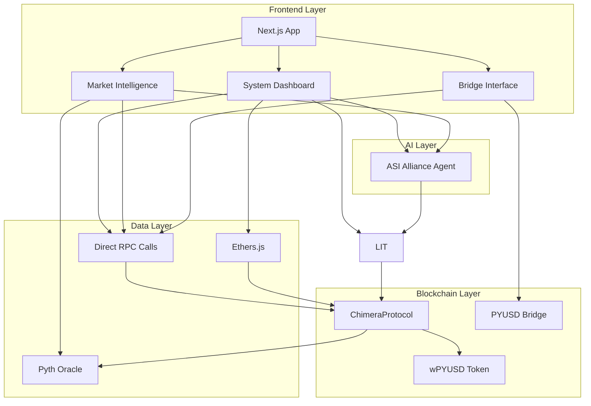

# ChimeraAI 🔮

An AI-powered prediction market platform on Hedera EVM with autonomous agents, Pyth Oracle integration, and PYUSD betting. Features ASI Alliance reasoning agents for intelligent, automated trading strategies.

## 🎯 Deployed Contracts (Hedera Testnet)

| Contract | Address | Status |
|----------|---------|--------|
| **ChimeraProtocol** | `0xeF2E2B87A82c10F68183f7654784eEbFeC160b44` | ✅ Deployed & Verified |
| **wPYUSD** | `0x9D5F12DBe903A0741F675e4Aa4454b2F7A010aB4` | ✅ Deployed & Working |
| **Pyth Oracle** | `0xa2aa501b19aff244d90cc15a4cf739d2725b5729` | ✅ Integrated & Tested |

## 🎯 Project Overview

ChimeraAI combines cutting-edge AI agents with decentralized prediction markets to create an autonomous, intelligent betting ecosystem. The platform leverages multiple sponsor technologies to deliver a comprehensive solution for AI-driven market predictions.

### 🏆 Sponsor Integrations

| Sponsor | Integration | Prize Track |
|---------|-------------|-------------|
| **ASI Alliance** | MeTTa reasoning agents for market analysis | AI Agent Integration |

| **Direct RPC** | Direct contract calls for real-time data | Data Infrastructure |
| **Pyth Network** | Oracle price feeds for price markets | Oracle Integration |


## 🚀 New Frontend Integrations

The frontend now includes comprehensive integrations with all system components:

### 📊 System Dashboard
- Real-time monitoring of all ecosystem components
- ASI Agent performance metrics
- System security status
- Bridge statistics and health monitoring
- Live price feeds from Pyth Network

### 🧠 Market Intelligence
- AI-powered market analysis using ASI Alliance agents
- MeTTa reasoning for contrarian betting strategies
- Sentiment analysis from multiple data sources
- Risk assessment and betting recommendations
- Real-time price condition monitoring

### 🌉 PYUSD Bridge Interface
- Seamless transfers between Ethereum and Hedera
- Real-time transfer status tracking
- Liquidity monitoring and fee calculation
- Transfer history and analytics

### 🔐 Enhanced Security
- Direct contract execution
- Secure transaction validation
- Audit trail and execution history
- Emergency stop mechanisms

## 🛠️ Architecture Overview


| **ASI Alliance** | MeTTa reasoning with direct contract analysis | 🚀 Best use of Artificial Superintelligence Alliance |
| **Hedera** | EVM contracts + Agent Kit integration | EVM Innovator Track + Best Use of Hedera Agent Kit |
| **Pyth Network** | Pull Oracle for market resolution | ⛓️ Most Innovative use of Pyth pull oracle |
| **PayPal USD** | Wrapped PYUSD as betting currency | 🥇 Grand Prize / 🎖️ PYUSD Consumer Champion |


## 🏗️ Architecture

```
┌─────────────────┐    ┌─────────────────┐    ┌─────────────────┐
│   ASI Alliance  │    │     Hedera      │
│   (Reasoning)   │────│   (Blockchain)  │
│                 │    │                 │
│ • MeTTa Logic   │    │ • EVM Contracts │
│ • Market Analysis│    │ • Agent Kit     │
│ • Strategy AI   │    │ • Low Fees      │
└─────────────────┘    └─────────────────┘    └─────────────────┘
         │                       │                       │
         └───────────────────────┼───────────────────────┘
                                 │
         ┌─────────────────┐    │    ┌─────────────────┐
         │   Direct RPC    │    │    │      Pyth       │
         │   (Ethers.js)   │────┼────│    (Oracle)     │
         │                 │    │    │                 │
         │ • Contract Calls│    │    │ • Price Feeds   │
         │ • Real-time Data│    │    │ • Pull Oracle   │
         │ • No Indexing   │    │    │ • Market Data   │
         └─────────────────┘    │    └─────────────────┘
                                │
                    ┌─────────────────┐
                    │      PYUSD      │
                    │   (Currency)    │
                    │                 │
                    │ • Wrapped Token │
                    │ • ERC-20 Compat │
                    │ • Bridge System │
                    └─────────────────┘
```

## 🚀 Quick Start

### Prerequisites

- Node.js 18+
- npm or yarn
- MetaMask with Hedera Testnet
- Hedera testnet HBAR
- Python 3.8+ (for ASI agent)

### Installation

1. **Clone and install dependencies:**
```bash
git clone https://github.com/your-repo/chimeraai
cd chimeraai
npm install
```

2. **Configure environment:**
```bash
cp .env.example .env
# Edit .env with your configuration
```

## 🧪 Headless Run (No Demo UI)

Run ASI Agent locally without any UI.

```powershell
# Start ASI Agent with HTTP Server (Windows PowerShell)
npm run start:asi-http

# Or start ASI Agent in mailbox mode
npm run start:asi-headless
```

Notes:
- Hyperon MeTTa is optional; if not installed, the agent falls back to heuristic logic.
- Agentverse/ASI:One registration is not required for headless mode.


## 📡 Direct RPC Integration

### Ethers.js Contract Calls
- Direct contract interaction without indexing:
  1. Uses Hedera Testnet RPC endpoint
  2. Real-time contract state reading
  3. No external dependencies or indexing delays
  4. Efficient for read-only operations

Environment variables (Windows PowerShell):
```powershell
$env:HEDERA_RPC_URL = "https://testnet.hashio.io/api"
```

Used by:
- ASI Agent: `agents/asi-agent/market_analyzer.py`
- Frontend: `src/hooks/useDirectContract.ts`

### Contract Integration
Access ChimeraProtocol data directly:

```powershell
$env:HEDERA_RPC_URL = "https://testnet.hashio.io/api"
$env:CHIMERA_CONTRACT_ADDRESS = "0x7a9D78D1E5fe688F80D4C2c06Ca4C0407A967644"
npm run test:frontend
```

3. **Deploy contracts:**
```bash
npm run compile
npm run deploy:hedera-testnet
```

4. **Start the platform:**
```bash
# Frontend
npm run dev

# ASI Agent
cd agents/asi-agent
python market_analyzer.py


# Direct RPC calls (no additional setup needed)
# Uses HEDERA_RPC_URL from .env
```

## 🔧 Core Components

### 1. Smart Contracts (Hedera EVM)

**ChimeraAI.sol** - Main prediction market contract with:
- PYUSD integration for betting
- Pyth Oracle for price-based market resolution
- Agent delegation system for autonomous betting
- Market creation and management
- Automated reward distribution

### 2. ASI Alliance Agent

**market_analyzer.py** - Enhanced intelligent market analysis agent:
- **Mailbox Agent**: Agentverse integration for remote communication
- **Chat Protocol**: Natural language interaction support
- **MeTTa Reasoning**: Advanced logic-based market analysis
- **Rate Limiting**: Prevents spam and ensures fair usage
- **OpenAI Integration**: Intelligent query processing and market filtering
- **Multi-Protocol Support**: Structured queries and chat messages
- **Direct RPC**: Real-time market data from Hedera contracts
- Implements contrarian betting strategies
- Executes trades directly via RPC


- Enforces spending limits and permissions
- Provides audit trail for all actions

### 4. Direct RPC Integration

Real-time blockchain data access:
- Direct contract calls via Ethers.js
- No indexing delays or external dependencies
- Real-time market state reading
- Efficient and reliable data access

### 5. Frontend (Next.js)

Modern web interface for:
- Market browsing and creation
- Manual betting and position management
- Agent delegation and configuration
- Real-time market data visualization

## 📊 Market Types

### Price Direction Markets
- **Oracle Integration:** Pyth Network price feeds
- **Resolution:** Automatic via price data
- **Examples:** "Will BTC be above $50k by Friday?"

### Custom Event Markets
- **Resolution:** Manual by market creator
- **Examples:** "Will it rain tomorrow?", "Who will win the election?"

## 🤖 AI Agent System

### ASI Alliance Integration
- **MeTTa Reasoning:** Advanced logical inference for market analysis
- **Data Sources:** Direct RPC calls + external sentiment
- **Strategies:** Contrarian betting, volume analysis, trend following


- **Permission Management:** Granular control over agent capabilities

## 🔗 Network Information

### Hedera Testnet
- **Chain ID:** 296
- **RPC:** https://testnet.hashio.io/api
- **Explorer:** https://hashscan.io/testnet
- **Currency:** HBAR

### Contract Addresses
- **ChimeraAI:** `TBD` (after deployment)
- **Wrapped PYUSD:** `0x95bc083e6911DeBc46b36cDCE8996fAEB28bf9A6`
- **Pyth Oracle:** `0x2880aB155794e7179c9eE2e38200202908C17B43`

## 🛠️ Development

### Available Scripts

```bash
# Smart Contracts
npm run compile              # Compile contracts
npm run deploy:hedera-testnet # Deploy to Hedera testnet
npm run test                 # Run contract tests

# Frontend
npm run dev                  # Start development server
npm run build               # Build for production
npm run start               # Start production server

# Direct Contract Integration
npm run test:frontend       # Test direct contract calls
npm run debug:frontend      # Debug contract integration

# Agents
cd agents/asi-agent && python market_analyzer.py    # Start ASI agent

```

### Testing

```bash
# Contract tests
npm run test

# Agent tests
cd agents/asi-agent && python -m pytest tests/

# Integration tests
npm run test:integration
```

## 📈 Usage Examples

### 1. Create a Price Market

```javascript
await chimeraContract.createMarket(
  "BTC Price Prediction",
  "Will Bitcoin be above $50,000 on Friday?",
  "Above $50k",
  "Below $50k",
  1, // category
  endTime,
  minBet,
  maxBet,
  imageUrl,
  0, // PriceDirection market
  btcPriceId, // Pyth price ID
  5000000000000, // $50k (scaled by 1e8)
  true // betting price will be above
);
```

### 2. Delegate to AI Agent

```javascript
await chimeraContract.delegateToAgent(
  agentAddress,
  ethers.parseUnits("100", 6) // Max 100 PYUSD per bet
);
```

### 3. Manual Betting

```javascript
// Approve PYUSD
await pyusdContract.approve(chimeraAddress, betAmount);

// Place bet
await chimeraContract.placeBet(marketId, option, betAmount);
```

## 🔒 Security Features

- **Agent Delegation:** Users maintain full control over agent permissions
- **Spending Limits:** Configurable maximum bet amounts per agent
- **Audit Trail:** All agent actions logged and verifiable
- **Oracle Security:** Pyth Network's secure price feed validation
- **Contract Verification:** All contracts verified on Hashscan

## 🌟 Key Features

- ✅ **AI-Powered Predictions:** ASI Alliance MeTTa reasoning
- ✅ **Secure Automation:** Lit Protocol Vincent Skills
- ✅ **Real-time Data:** Envio HyperIndex integration
- ✅ **Oracle Integration:** Pyth Network price feeds
- ✅ **Stable Currency:** PYUSD betting with bridge system
- ✅ **Low Fees:** Hedera EVM efficiency
- ✅ **Full Transparency:** On-chain verification via HashScan

## 📞 Support

- **Documentation:** [Link to docs]
- **Discord:** [Community link]
- **GitHub Issues:** [Issues link]
- **Email:** support@chimeraai.com

## 📄 License

MIT License - see [LICENSE](LICENSE) file for details.

---

**Built with ❤️ for the future of AI-powered prediction markets**
