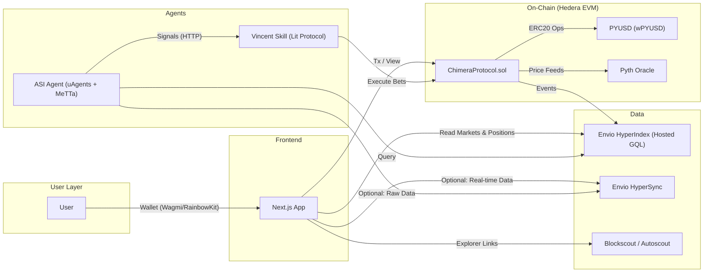
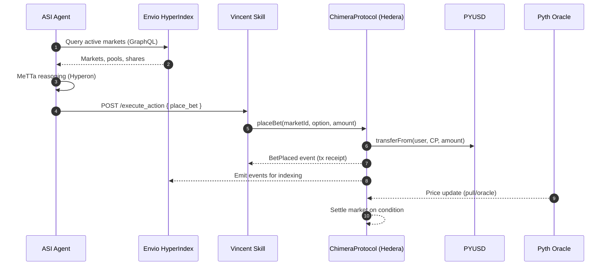

# System Diagrams

## High-Level Architecture

## Headless Execution Sequence

## Components
- Frontend: `Next.js` app (headless optional)
- ASI Agent: uAgents + MeTTa (Hyperon) with fallback
- Vincent Skill: Lit Protocol programmable signing (execute_action)
- Envio: HyperIndex (GQL) + HyperSync
- On-Chain: `ChimeraProtocol.sol`, Pyth Oracle, PYUSD (wPYUSD)
- Observability: Blockscout/Autoscout
