# ChimeraProtocol System Diagrams 📊

Technical architecture diagrams focusing on Pyth, PYUSD, and Hedera integrations.

## 🏗️ System Architecture

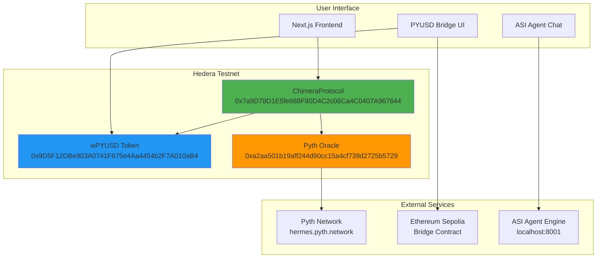

## 💰 PYUSD Bridge Flow

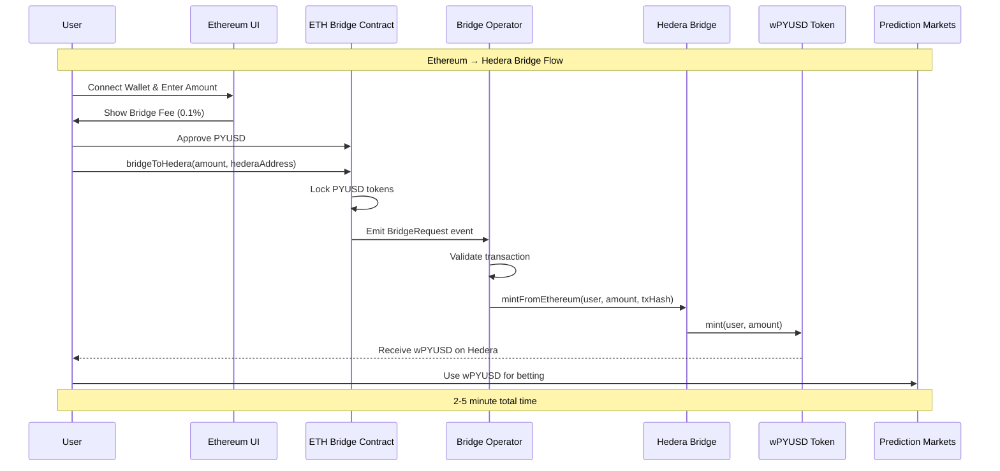

## 📊 Pyth Oracle Integration

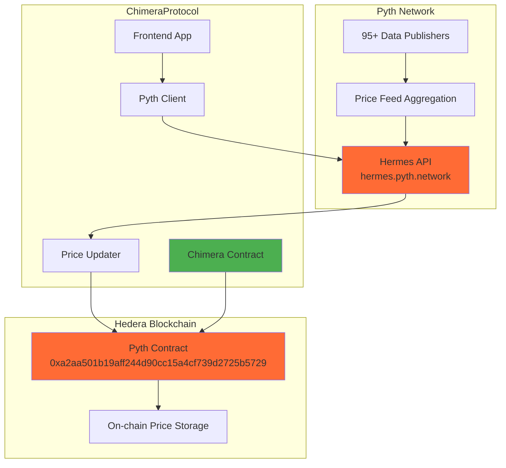

## 🔄 Market Lifecycle

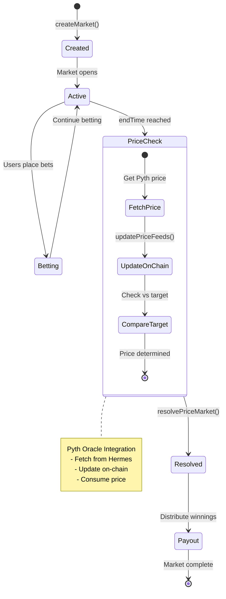

## 🤖 ASI Agent Architecture

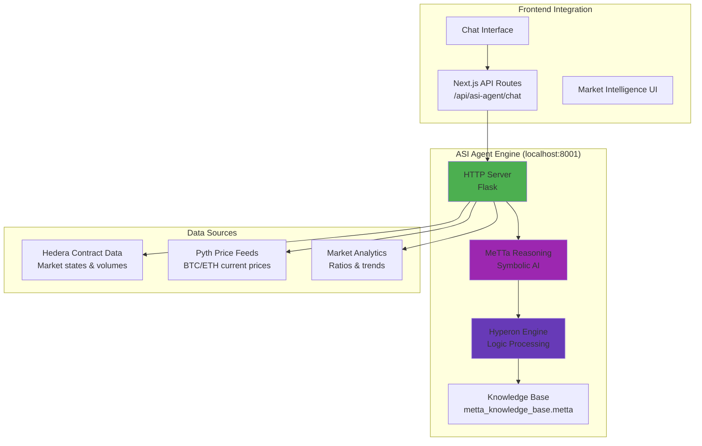

## 💹 Market Analysis Flow

```mermaid
flowchart TD
    Start([User Query: "analyze markets"]) --> Fetch[Fetch Market Data]
    Fetch --> GetPrices[Get Pyth Prices]
    GetPrices --> MeTTaRules[Apply MeTTa Rules]
    
    subgraph "MeTTa Reasoning"
        MeTTaRules --> ContrarianCheck{Contrarian Signal?}
        ContrarianCheck -->|>75% bias| HighSignal[High Contrarian]
        ContrarianCheck -->|65-75% bias| MedSignal[Medium Contrarian]
        ContrarianCheck -->|<65% bias| LowSignal[Low Contrarian]
    end
    
    subgraph "Risk Assessment"
        HighSignal --> VolumeCheck{Volume > 5000?}
        MedSignal --> VolumeCheck
        LowSignal --> VolumeCheck
        VolumeCheck -->|Yes| LowRisk[Low Risk]
        VolumeCheck -->|No| HighRisk[High Risk]
    end
    
    subgraph "Recommendation"
        LowRisk --> BuyRec[BUY Recommendation]
        HighRisk --> HoldRec[HOLD Recommendation]
    end
    
    BuyRec --> Response[Return Analysis]
    HoldRec --> Response
    Response --> End([Display to User])
    
    style MeTTaRules fill:#9C27B0
    style ContrarianCheck fill:#673AB7
    style Response fill:#4CAF50
```

## 🔐 Security Architecture

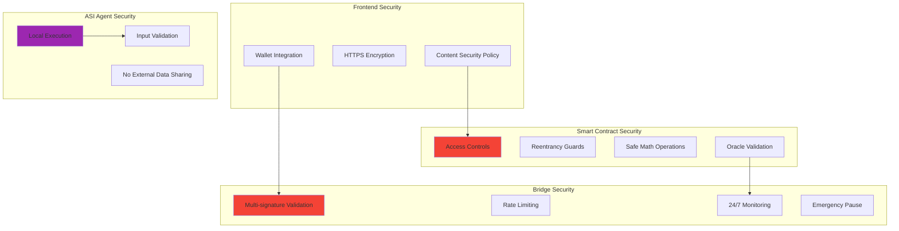

## 📈 Data Flow Diagram

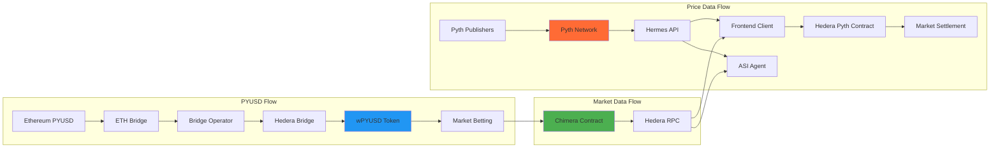

## 🎯 Integration Points

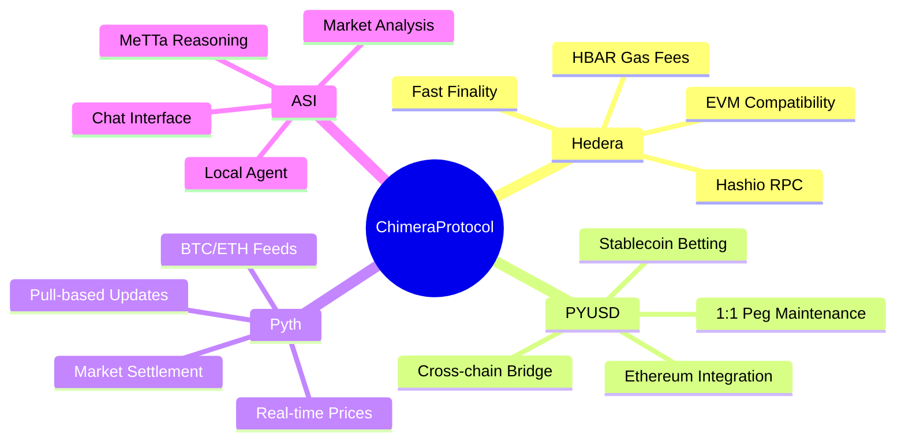

## 🔄 User Journey

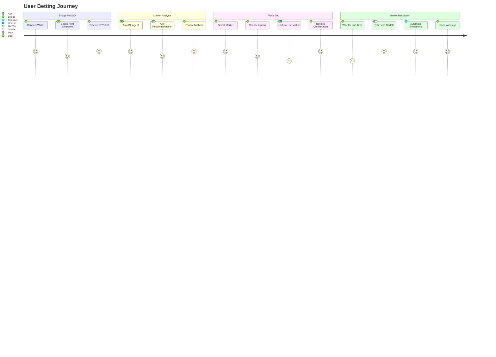

## 🏆 Technology Stack

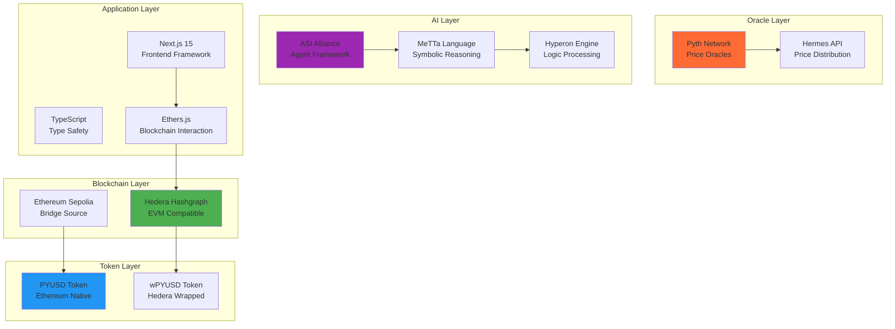

## 🔄 Market Settlement Process

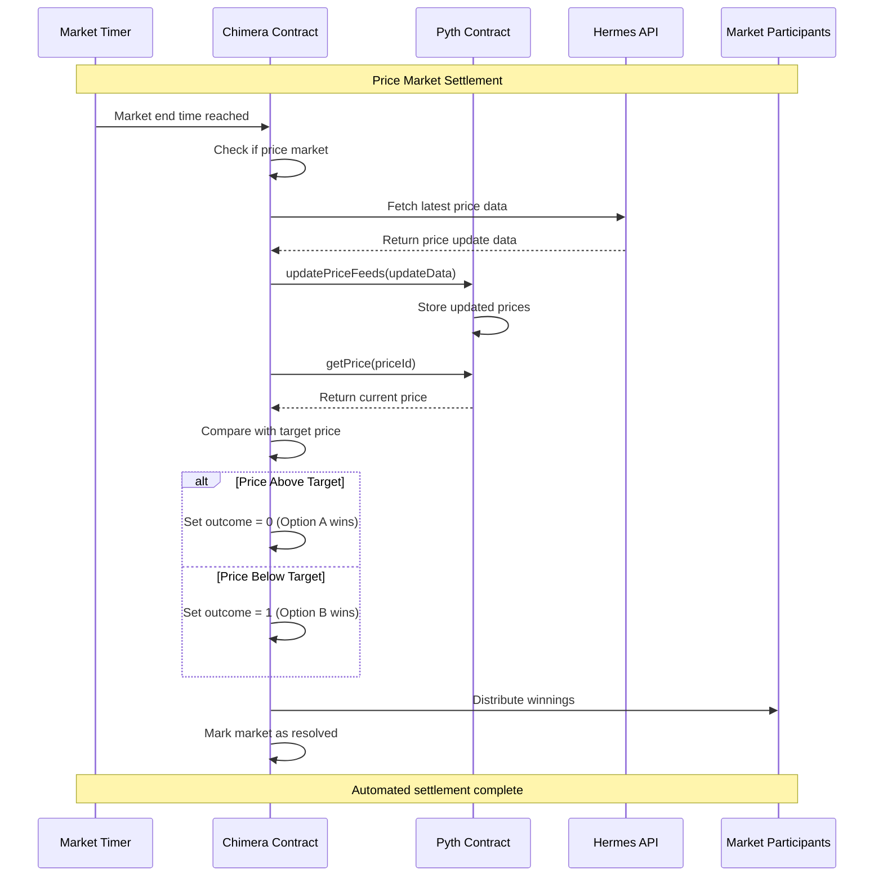

## 🌉 PYUSD Bridge Architecture

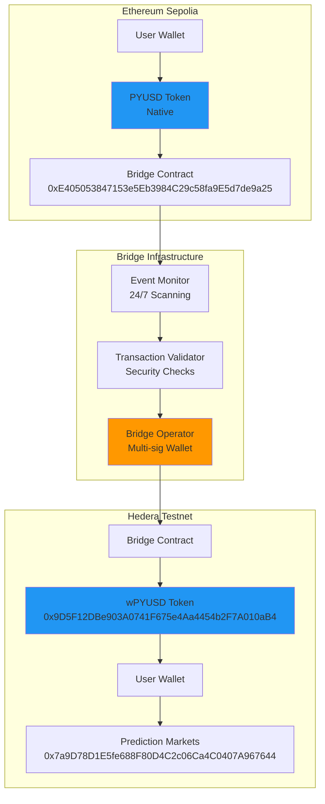

## 🧠 ASI Agent Reasoning Flow

```mermaid
flowchart TD
    UserQuery[User Query<br/>"analyze markets"] --> HTTPServer[HTTP Server<br/>:8001]
    HTTPServer --> DataFetch[Fetch Market Data]
    
    subgraph "Data Collection"
        DataFetch --> HederaData[Hedera Contract<br/>Market states & volumes]
        DataFetch --> PythData[Pyth Prices<br/>BTC/ETH current prices]
        DataFetch --> Analytics[Calculate Ratios<br/>Option A/B percentages]
    end
    
    subgraph "MeTTa Reasoning Engine"
        Analytics --> MeTTaParser[MeTTa Parser<br/>Parse expressions]
        MeTTaParser --> RuleEngine[Rule Engine<br/>Apply logic rules]
        RuleEngine --> ContrarianLogic{Contrarian Signal<br/>Detection}
        ContrarianLogic -->|>75% bias| HighContrarian[High Contrarian<br/>Confidence: 0.8-0.9]
        ContrarianLogic -->|65-75% bias| MedContrarian[Medium Contrarian<br/>Confidence: 0.6-0.7]
        ContrarianLogic -->|<65% bias| LowContrarian[Low Contrarian<br/>Confidence: 0.4-0.5]
    end
    
    subgraph "Risk Assessment"
        HighContrarian --> VolumeCheck{Volume Analysis}
        MedContrarian --> VolumeCheck
        LowContrarian --> VolumeCheck
        VolumeCheck -->|>5000 PYUSD| LowRisk[Low Risk<br/>Recommend BUY]
        VolumeCheck -->|<1000 PYUSD| HighRisk[High Risk<br/>Recommend HOLD]
        VolumeCheck -->|1000-5000| MedRisk[Medium Risk<br/>Conditional BUY]
    end
    
    LowRisk --> Response[Generate Response<br/>JSON format]
    HighRisk --> Response
    MedRisk --> Response
    Response --> HTTPServer
    HTTPServer --> UserInterface[Return to User]
    
    style MeTTaParser fill:#9C27B0
    style RuleEngine fill:#673AB7
    style Response fill:#4CAF50
```

## 📊 Price Feed Integration

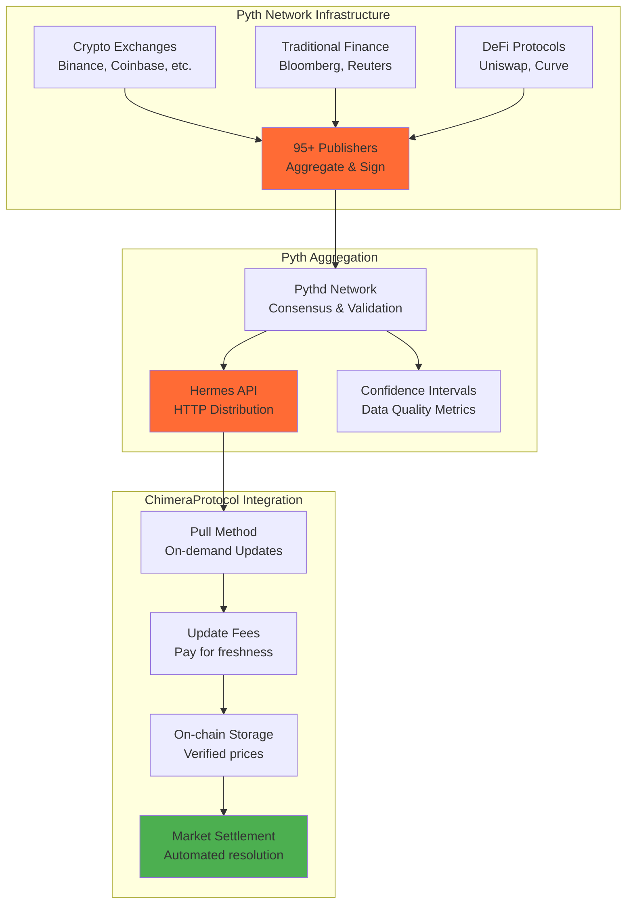

## 🎮 User Interaction Flow

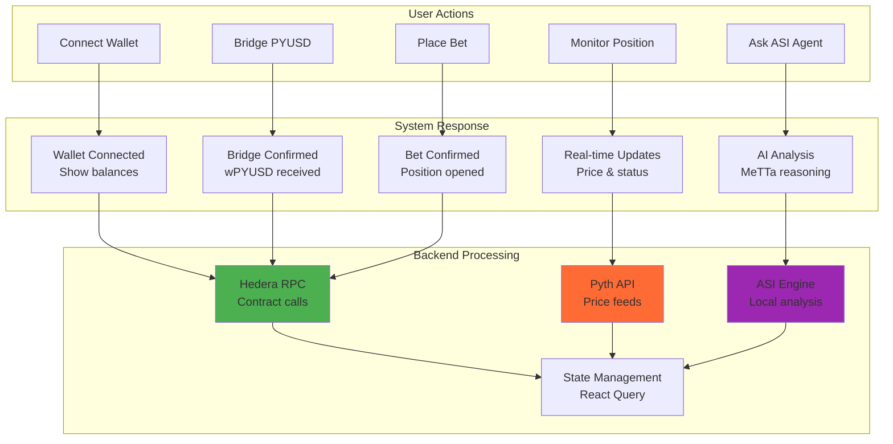

## 🔧 Development Architecture

```mermaid
graph TB
    subgraph "Development Environment"
        NextDev[Next.js Dev Server<br/>:3000]
        ASIDev[ASI Agent Server<br/>:8001]
        HotReload[Hot Reload<br/>Real-time updates]
    end
    
    subgraph "Testing Infrastructure"
        Hardhat[Hardhat Framework<br/>Contract testing]
        Jest[Jest Testing<br/>Frontend tests]
        Python[Python Tests<br/>Agent testing]
    end
    
    subgraph "Deployment"
        Vercel[Vercel Frontend<br/>Production hosting]
        HederaDeploy[Hedera Contracts<br/>Testnet deployment]
        AgentDeploy[Agent Deployment<br/>Local or cloud]
    end
    
    NextDev --> HotReload
    ASIDev --> HotReload
    Hardhat --> HederaDeploy
    Jest --> Vercel
    Python --> AgentDeploy
    
    style NextDev fill:#000000
    style ASIDev fill:#9C27B0
    style HederaDeploy fill:#4CAF50
```

---

**Key Technologies**: Hedera Hashgraph • Pyth Network • PYUSD • ASI Alliance • MeTTa Reasoning