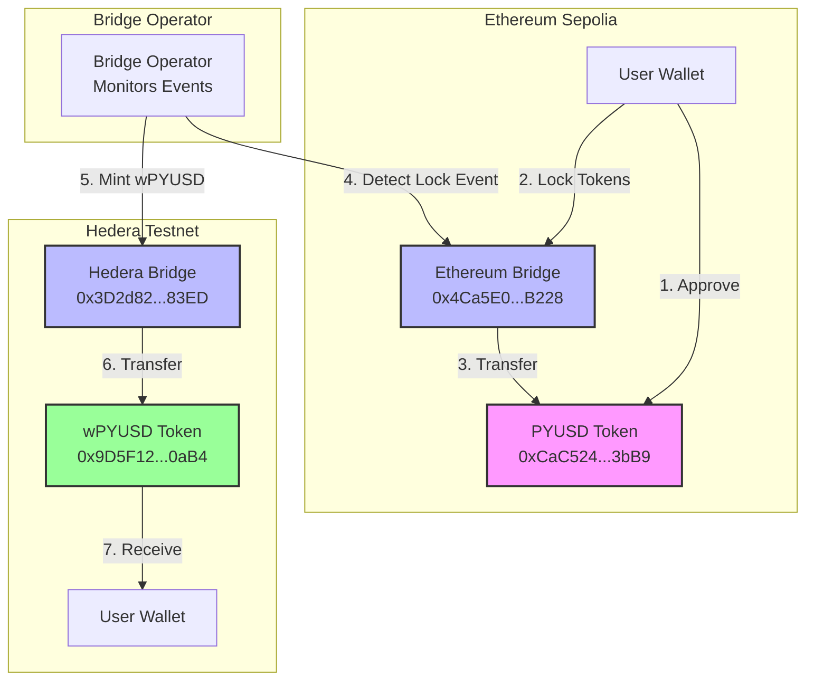
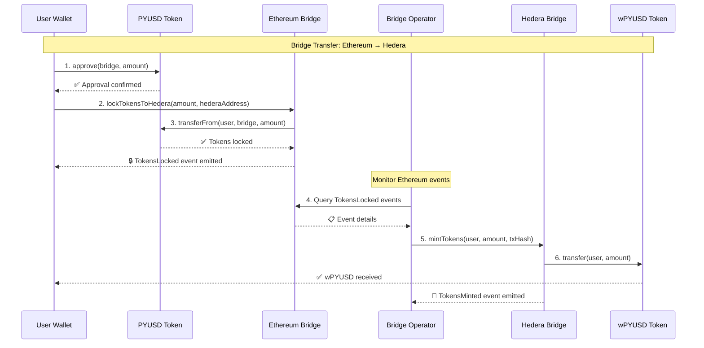
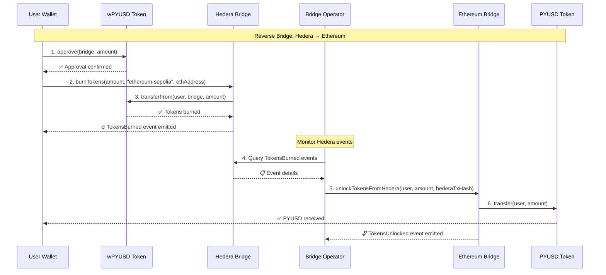
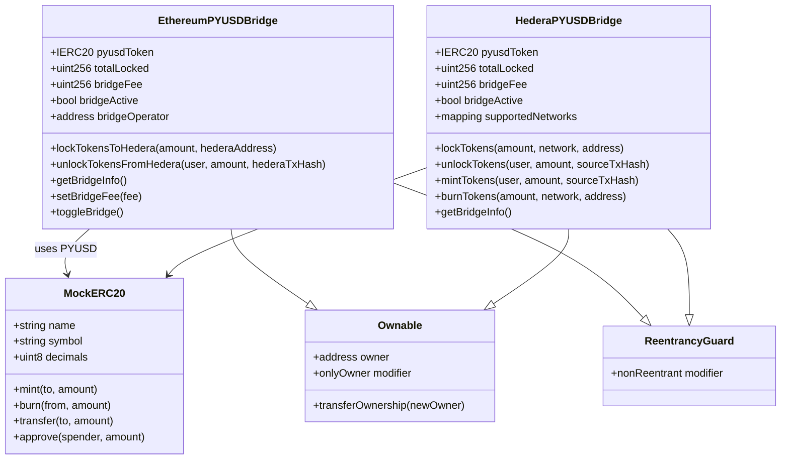
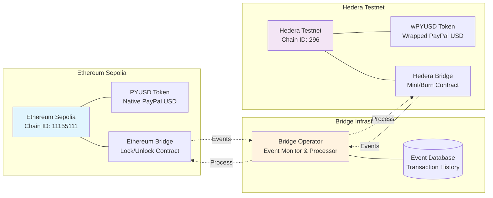
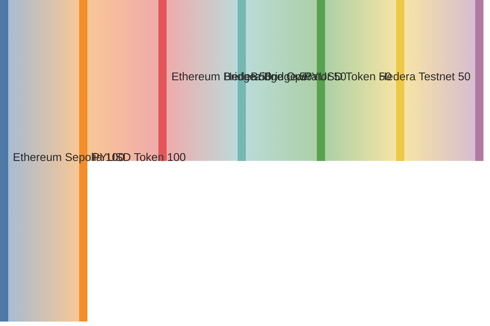
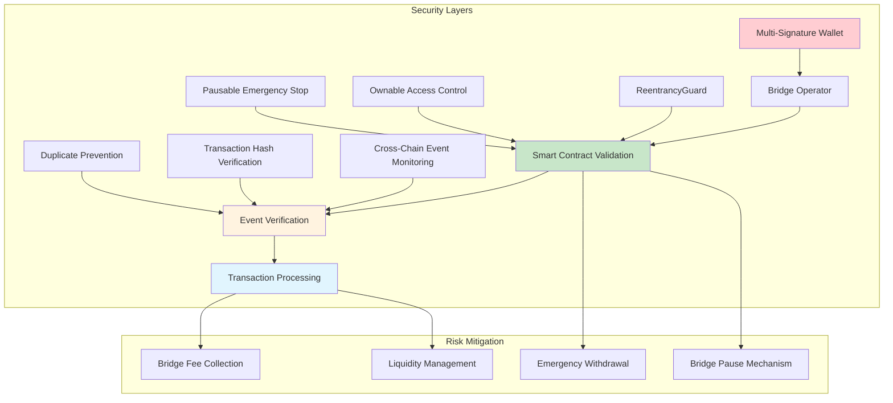
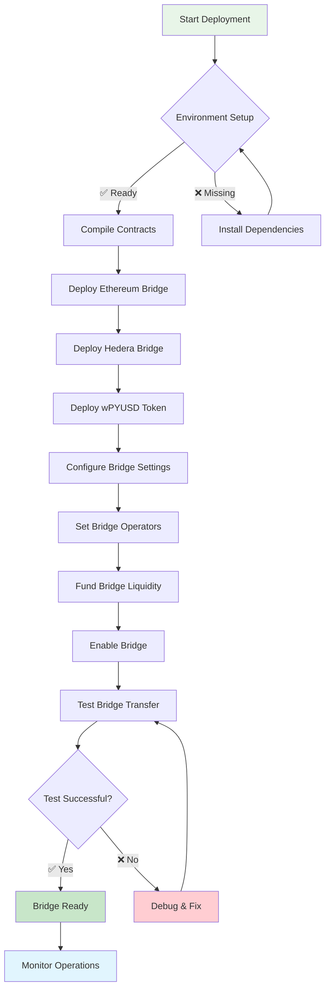
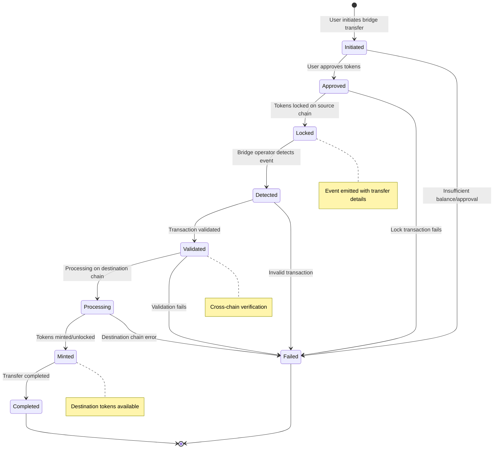

# Hedera PYUSD Bridge - Architecture Diagrams

This document contains visual representations of the bridge architecture and flow using Mermaid diagrams.

## 🏗️ System Architecture

## 🔄 Bridge Transfer Flow

## 🔙 Reverse Bridge Flow (Hedera → Ethereum)

## 🏛️ Contract Architecture

## 🌐 Network Topology

## 📊 Token Flow Diagram

## 🔐 Security Model

## 🚀 Deployment Flow

## 📈 Transaction Lifecycle

---

## 📝 Notes

- All diagrams represent the current testnet implementation
- Production deployment would include additional security measures
- Bridge operator currently runs manually but can be automated
- Future LayerZero integration planned when Hedera support is available